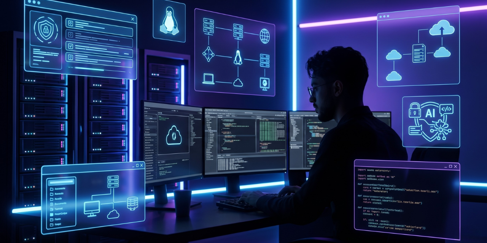

# 👋 Hey, I'm Oussama Ennaji

### 💻 Digital Infrastructure, Networks & Systems Student

Passionate about:

* Linux Systems
* Networking
* Cybersecurity
* Cloud & Infrastructure
* Automation & Labs

---

## 🚀 Currently Learning

* Linux Administration
* Network Configuration
* Cybersecurity Fundamentals
* Cloud Technologies
* Infrastructure Automation

---

## 🛠️ Technologies & Tools

* Linux
* Git & GitHub
* Cisco Packet Tracer
* VirtualBox
* Docker
* Bash
* Python Basics

---

## 📚 Current Goals

* Build real infrastructure projects
* Improve cybersecurity skills
* Create professional portfolio
* Earn industry certificates
* Grow GitHub profile daily

---

> “Best Of Me — Built Daily.” 🔥
